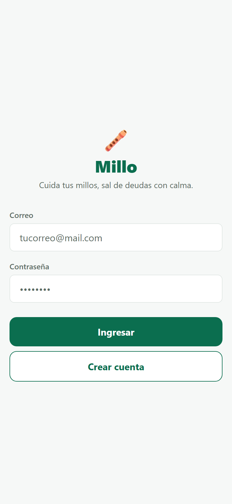
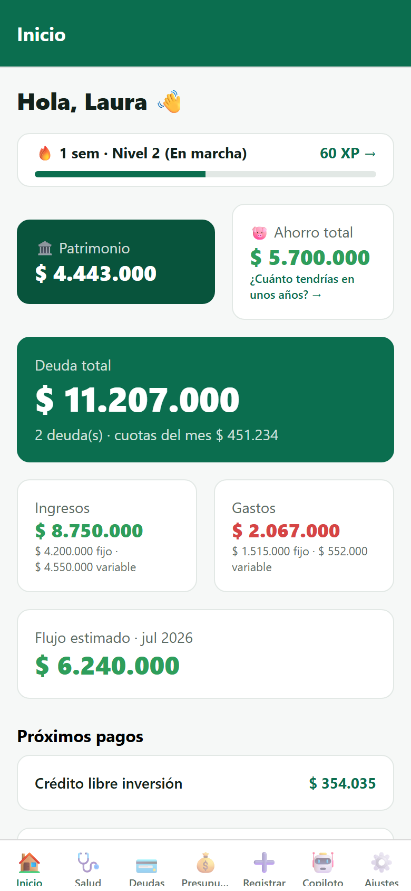
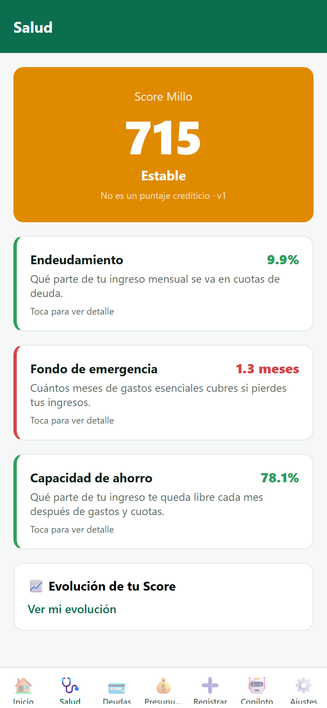
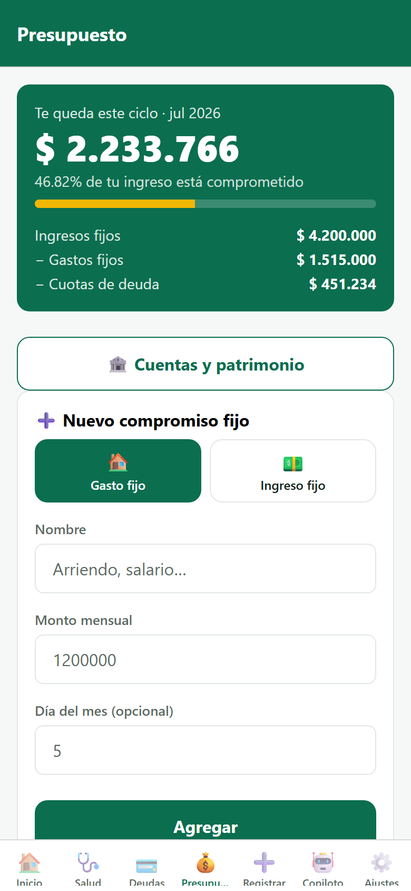

# Capturas de producto · Lote 01

- **Solicita:** CTO (dinámica iterativa de lotes, con aval del CPSAO)
- **Entrega:** Arquitecto · 2026-07-06
- **Origen de las capturas:** aplicación REAL corriendo (Expo Web del mismo código
  del repo, backend NestJS + Postgres reales, usuaria demo `demo.laura@millo.app`
  con datos sembrados por API). No son mockups. Resolución 390×844 @2x.
- **Reproducción:** backend + `npx expo start` en `frontend/` →
  `http://localhost:8081` en un navegador (el soporte web se habilitó con tooling
  puro: deps `react-native-web`/`react-dom`, `metro.config.js` y 2 shims web-only
  en `frontend/web-shims/` — el bundle nativo de Android/iOS no cambia).

---

## 1. Login

**Flujo:** primera pantalla al abrir la app sin sesión iniciada.

## 2. Inicio (Dashboard)

**Flujo:** tras iniciar sesión se aterriza aquí; es la pestaña "Inicio" de la barra inferior.

## 3. Salud (Score Millo)

**Flujo:** pestaña "Salud" de la barra inferior, segunda posición.

## 4. Presupuesto

**Flujo:** pestaña "Presupuesto" de la barra inferior, cuarta posición.
