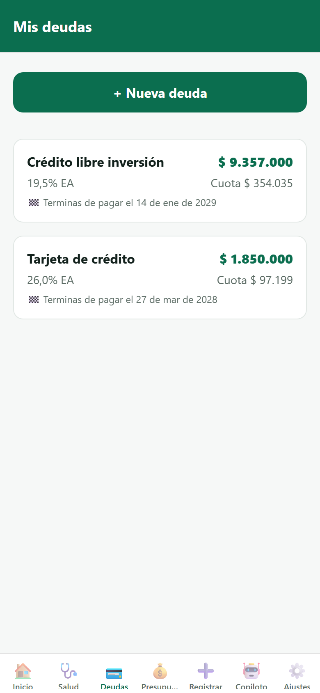
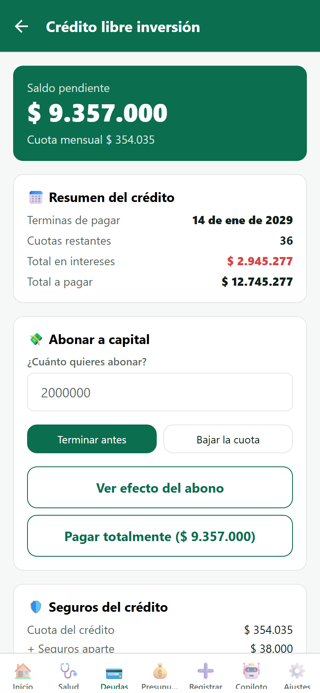
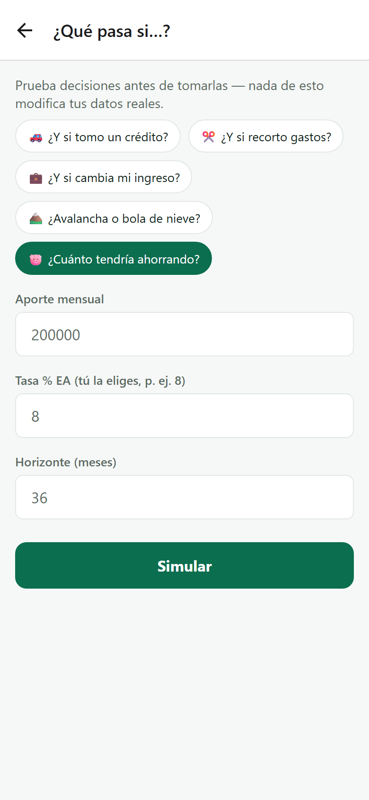
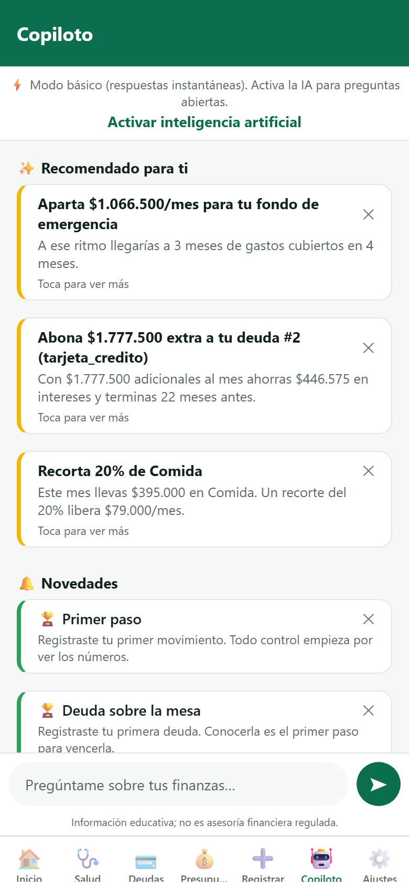

# Capturas de producto · Lote 02

- **Solicita:** CTO (dinámica iterativa de lotes)
- **Entrega:** Arquitecto · 2026-07-11
- **Origen:** aplicación REAL corriendo (mismo método del Lote 01: Expo Web del
  código del repo, backend + Postgres reales, usuaria demo `demo.laura@millo.app`).
  390×844 @2x. No son mockups.

---

## 5. Mis deudas

**Flujo:** pestaña "Deudas" de la barra inferior, tercera posición.

## 6. Detalle de deuda

**Flujo:** desde "Mis deudas", tocando cualquier deuda de la lista. (Visible en la
captura: abono a capital de FIN-012 con "Terminar antes / Bajar la cuota", pago total,
y el desglose de seguros de FIN-013.)

## 7. Simulador "¿Qué pasa si…?"

**Flujo:** desde Inicio tocando la tarjeta "🐷 Ahorro total → ¿Cuánto tendrías en unos
años?" (llega con ese escenario preseleccionado); también desde los indicadores de
Salud en amarillo/rojo.

## 8. Copiloto

**Flujo:** pestaña "Copiloto" de la barra inferior, sexta posición. (Estado real: modo
básico con IA desactivada — el opt-in de consentimiento es el flujo normal de un
usuario nuevo; recomendaciones e insights generados por el motor real con los datos
de la usuaria demo.)
